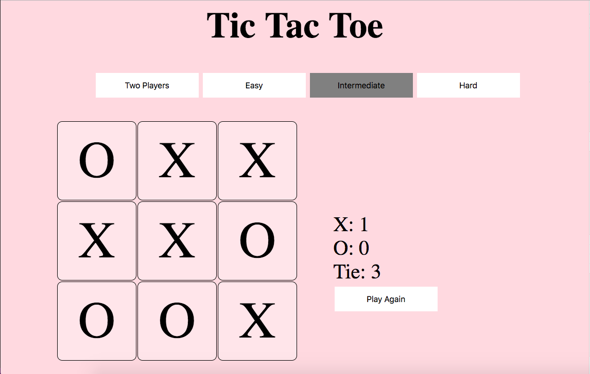

# TIC TAC TOE

Tic Tac Toe game  which contains four levels: easy, intermidate, hard and two players.
[Play here](https://rawanah995.github.io/project1/gamePage.html)

## Technologies
* HTML.
* CSS.
* Jquiery.
* JavaScript

## Features:
* Easy : computer plays randomly and user can win easily.
* Intermediate: user can win but isn't easy.
* Hard: unbeatable.
* Two Players.

## Future work
* Adding 4*4 unbeatable board.
* Working on the design.

## Thanks
* Thanks for my amazing instructors.
* Thanks for best tester Hala Almaimoni.
* Thanks for my great class mates.

